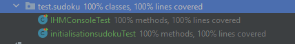
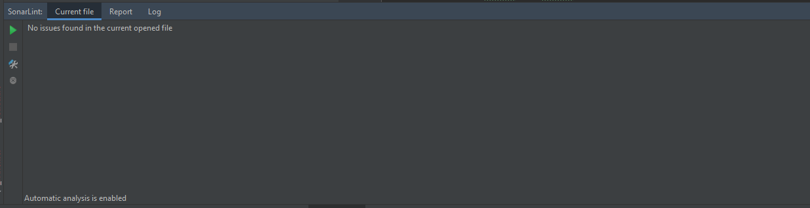

ProjetSudoku
<p>
Auteur : Corentin BICHON NOUGAILLAC </p> <p>
Cadre : TD noté en informatique 1 année 3IL Rodez

</p>

<h5> Importer le projet Git : </h5>

``` 
Git init 
Git clone https://github.com/corentin-bichon/ProjetTDgit.git
``` 

<p> 2 branches :  Master ( mode production ) &
                  Développement ( mode codage & Test )  </p>
                
<p> Pull request obligatoire pour merge Développement sur Master </p>


<h5> Test réalisé à l’aide de Junit </h5>
<p> Coverage : 100% </p>



<h5> Normes de codage respectaient avec SonarLint </h5>



<p> SonartLint de detecte aucun problème , les bonnes pratiques de codages sont respectés</p>


